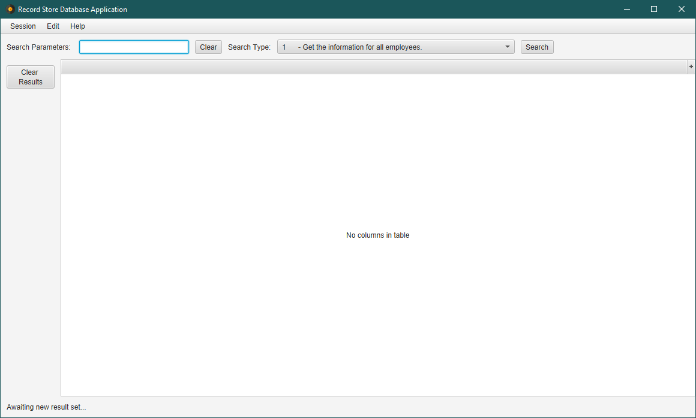

# Record Store

Project designed for SER322: Database Management at Arizona State University by group 18 for Summer Session B 2022.

## Description

Record Store is a database and application to aid record store employees. The system should allow 
employees to find what a customer is looking for. The database contains a list of records and their stock quantity
along with additional information about artists, songs, genres, etc.

## Schema

## Initializing the Database

We have automated the initialization of the database with a gradle task.

Navigate to the record-store root directory in a terminal window and run the following command:

`gradle createDB -Purl="jdbc:mysql://localhost:3306/record-store?userSSL=false&useOldAliasMetadataBehavior=true" -Puser="root" -Ppwd="pass"`

### Parameters
You will need to replace the above parameters to match your own database connections parameters.

1. **URL** - The URL for the database that you would like to interact with including host and port.
   - You must set userSSL to false as shown in the example in order to log in properly.
   - You must also set useOldAliasMetadataBehavior to true as shown.
2. **Username** - The name of the user to connect with.
3. **Password** - The specified user's password.

### Task Description
Running the above task will execute four initialization scripts in order:

1. **Drop** - Drops preexisting tables that have names that exist in our schema.
   - This ensures that when you run this task duplication does not occur.
2. **Create** - Creates all tables in our schema.
3. **Insert** - Populates the tables with the initial data provided.
4. **Lyrics** - Updates certain songs with their lyrics. This was done with a separate script to enhance readability.

## Environment
To maximize compatibility, we recommend running our application in the environment detailed below.

- MySQL 8.0.29 (Query Language)
- Java 11.0.13 (JDK)
- Gradle 6.6.1 (Build Tool)
- JDBC 8.0.29 (Database API)

## Steps for Execution

Navigate to the record-store root directory in a terminal window and run the following command:

`gradle runGUI -Purl="jdbc:mysql://localhost:3306/record-store?userSSL=false&useOldAliasMetadataBehavior=true" -Puser="root" -Ppwd="pass"`

The parameters for this task are the same as for the `createDB` task. See above descriptions.

If execution is a success, you will see the following screen:

### Running a Query

1. Select a search type from the drop-down.
2. If the query requires parameters, enter them into the *Search Parameters* text field.
   - If multiple parameters are required, they should be separated by commas.
   - For example: 
3. Press the *Search* button.
   - The results will populate the table view.

### Adding a New Employee

1. In the menu bar, navigate to Edit > Insert > Employee
2. A new employee dialog will appear. Enter the new employee's name into the text field provided, 
select a location from the drop-down and press OK.
3. You may run query 1 in the main app window to check if your new employee is stored correctly.

### Adding a New Location

1. In the menu bar, navigate to Edit > Insert > Location
2. A new location dialog will appear. Enter the new location's name, address, and phone number 
into the text fields provided.
3. Press OK
4. You may run query 2 in the main app window to check if your new location is stored correctly.

### Updating an Existing Location

1. In the menu bar, navigate to Edit > Update > Location
2. An update location dialog will appear. Select the location to update from the drop-down.
3. Select which field you'd like to update from other drop-down.
4. Enter the value you'd like to change it in the new value text field.
5. Press OK
6. You may run query 2 in the main app window to check if your new location is updated correctly.

### Deleting an Album

1. In the menu bar, navigate to Edit > Delete > Album
2. A delete album dialog will appear. Enter the album title you'd like to delete.
3. Press OK
4. You may run query 3 in the main app window to check if your new album is removed correctly.

## Video Presentations

- [Deliverable 3](https://www.youtube.com/watch?v=8NFbX4rywlE)
- Deliverable 4

## Contributors 

The members of group 18 are listed below along with their individual contributions.

### [Andrew Tonn](https://github.com/attonn7)

- Contributed to proposal
- Contributed to creation of ERD
- Contributed to database design before generating SQL from the relational schema
- Wrote 1/4 of the insert statements
- Wrote 1/4 of the initial queries
- Implemented insert method
- Implemented delete method
- Implemented delete album dialog
- Reviewed github pull-requests

### [Steven Stabile](https://github.com/sstabile)

- Contributed to proposal
- Contributed to creation of ERD
- Contributed to database design before generating SQL from the relational schema

### [Nathanael Swecker](https://github.com/ndswecker)

- Contributed to proposal
- Contributed to creation of ERD
- Converted ERD to relational schema
- Contributed to database design before generating SQL from the relational schema
- Contributed 3 SQL queries
- Contributed 2 albums
- Converted all 12 static sql script to dynamic scripts
- Created enum to hold script query paths
- Tested all selects
- Generated QueryLogic.java functionality and collaborated on its refactoring
- Generated build.gradle and collaborated on its additional functionality
- Hosted weekly team meetings
- Reviewed multiple github pull-requests

### [Ian Skelskey](https://github.com/IanSkelskey)

- Created a Slack channel for the group and hosted initial meetings
- Contributed to proposal
- Contributed to creation of ERD
- Contributed to database design before generating SQL from the relational schema
- Created git repository
- Created GitHub project
- Set git standards for the team
  - Two reviews for main
  - One review for Development
  - Working branches for each contributor
  - Continuous Integration
- Created and maintained README.md
- Wrote 1/4 of the insert statements necessary to populate database
- Wrote 1/4 of the initial queries for deliverable 3
- Added lyrics for 1 album
- Hosted team meetings
- Met with team members individually to maintain consistent vision
- Reviewed pull requests
  - Refactored submissions where necessary
- Updated query enum
- Wrote the DBInitializer class
- Wrote the SQLHelper class and documentation
- Wrote a dynamic query menu for the terminal UI
- Contributed to GUI design:
  - Created DialogType enum to simplify creation of many similar dialogs.
  - Created About Dialog
  - Created Insert Employee Dialog
  - Created Insert Location Dialog
  - Created Update Location Dialog
  - Added GitHub repo link to the help menu
  - Added icons to enhance design and clarity.

## Assets

- [Add Employee Icon](https://www.flaticon.com/free-icons/add-user)
- [App Icon](https://www.flaticon.com/free-icons/vinyl)
- [Location Icon](https://www.flaticon.com/free-icons/shop)
- [Album Icon](https://www.flaticon.com/free-icons/album)